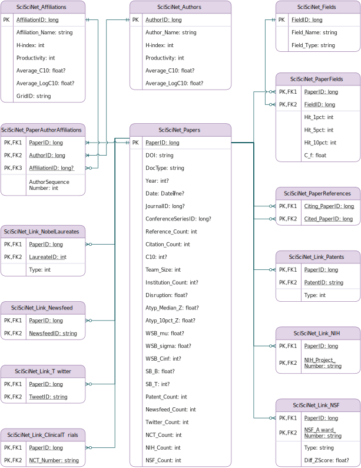

# SciSciNet
A large-scale open data lake for the science of science research.

You can refer to our paper: "SciSciNet: A large-scale open data lake for the science of science research" for more details.

## Overview

**Fig1: The entity relationship diagram of SciSciNet.**

